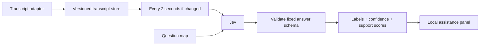

# Live in-call assistance using Jev

**By Ampup Team** · Sales calls and MEDDPICC as a worked example

**This is an example implementation to build on, not a standalone product.** It shows how to put live in-call assistance on Jev so you can lift the pattern into your own service. It turns a live transcript into signals a rep can act on while the call is still going. Every two seconds, if the transcript changed, it sends the whole transcript plus a fixed set of questions to [Jev](https://docs.typesafe.ai/models) in one request, and paints the answers on a local dashboard: a label, a probability for every allowed label, a confidence, and an overall coverage number.

MEDDPICC is the worked example: **eight questions × three labels** (unknown, supported, contradicted). BANT and sentiment maps are included so you can see how the same loop serves other structured assistance.

## What you need

1. **Python 3.11 or newer.** Nothing else to install system-wide.
2. **A TypeSafe API key.** Jev is TypeSafe's classifier. Get a key at [docs.typesafe.ai](https://docs.typesafe.ai/). **There is no offline or mock mode.** Every score you see is a real Jev answer. Scoring the bundled sample call costs a fraction of a cent; a 30-minute call is roughly $0.17 ([napkin math](#what-it-costs)).
3. **A transcript source, when you move past the sample.** Jev scores a transcript; it does not produce one. This repo starts from *text* and does not join calls, record audio, or do speech-to-text. You connect a transcript through one of the included adapters (Google Meet via a Recall bot, a webhook, or a WebSocket stream), or write your own against a six-field event schema.
4. **A speaker role map, if you use MEDDPICC.** Its questions ask for buyer evidence, so every turn must arrive labeled `buyer`, `seller`, or `participant`, or the scores are noise.

Items 3 and 4 are the real setup cost, and they are external services and your own data rather than anything this repo installs.

If you only want to read the exact request the app sends, `jev-incall evaluate examples/snapshot.json --dry-run` prints it without a key or a network call.

## 1. See it work on the sample call

Install, export your key, start the server:

```bash
git clone https://github.com/A79-ai/jev-incall-assistance.git
cd jev-incall-assistance
python3 -m venv .venv
source .venv/bin/activate          # Windows: .venv\Scripts\Activate.ps1
python -m pip install -e .

export TYPESAFE_API_KEY="your-typesafe-api-key"
jev-incall serve
```

Open **http://127.0.0.1:8000** and click **Replay sample call**. The app feeds eight buyer statements from a synthetic discovery call, one every 2.5 seconds, and Jev scores the growing transcript after each one. Over about 20 seconds the MEDDPICC cards move from *unknown* to *supported*, coverage climbs to 100%, and the header shows which transcript version was evaluated and how long the last call took.

Then type your own line into the transcript box as **Buyer** and watch which fields it moves. "Our reporting takes 20 hours each week. We want to cut that in half." establishes Metrics and nothing else. "Priya, our CFO, signs off on this" establishes Economic Buyer. A friendly "this looks great" establishes nothing, which is the point.

The key stays in the Python process, the server binds to loopback only, and transcript text is sent to TypeSafe and nowhere else.

## 2. Connect your own transcript

Once the sample works, the question is where your text comes from. The app never accepts audio; something upstream must produce finalized transcript turns with a speaker role. Three adapters are included:

| Your source | What you need | Start here |
| --- | --- | --- |
| **A Google Meet call** | A [Recall](https://recall.ai) account (bot + transcription, billed separately) and an HTTPS tunnel such as ngrok | [Google Meet quick start](docs/google-meet.md) |
| **A transcription service that can POST** | A bearer token you generate | [Webhook quick start](docs/streaming-and-webhooks.md#path-a-webhook) |
| **A streaming transcript** | Same token, one turn per WebSocket frame | [WebSocket quick start](docs/streaming-and-webhooks.md#path-b-websocket-input) |
| **Your own app wants the scores** | Nothing extra | [Server-sent events](docs/streaming-and-webhooks.md#path-c-stream-scores-out) |

All three ingestion paths go through a separate, authenticated gateway on port 8001 that is bound to one meeting. The dashboard and its control API on port 8000 stay private. The [transcript adapter guide](docs/transcript-adapter.md) documents the six-field `Turn` event (`turn_id`, `speaker_role`, `start_ms`, `text`, `revision`, `final`) if you are writing an adapter for a provider that is not covered.

Two things first-timers get wrong:

- **Speaker roles matter.** The MEDDPICC rubric counts only *buyer* evidence. A seller saying "you told us this costs you 20 hours" does not establish Metrics. Map your participants to `buyer`, `seller`, or `participant` explicitly; unmapped speakers are never assumed to be the buyer.
- **Corrections replace, they do not append.** If your provider revises a turn, resend it with the same `turn_id` and a higher `revision`. The transcript then contains the corrected text once.

Before wiring anything external, `python scripts/smoke.py` runs both servers, both senders, and signed Recall fixtures against a local stand-in for the Jev API and prints `PASS:`. It needs no accounts and proves the wiring, not classification.

## 3. Change what it listens for

The questions are the part you swap per use case. Each entry in a question map has a `type` of `choice`, an `instructions` string containing the complete question, and a `criteria` map naming the allowed labels. The shipped maps are [MEDDPICC](src/jev_incall/prompts/meddpicc.json), [BANT](src/jev_incall/prompts/bant.json), and [sentiment](src/jev_incall/prompts/sentiment.json).

```bash
jev-incall evaluate examples/snapshot.json --framework bant
jev-incall evaluate examples/snapshot.json --questions local/questions.json --dry-run
```

The [prompt guide](docs/prompts.md) walks through writing a map for a new signal, what to keep fixed (the labels) and what to put in the rubric (the evidence boundaries), and how to evaluate changes against labeled snapshots before trusting them.

## How it works



- Finalized turns are upserted by stable ID. A higher revision replaces a corrected turn.
- One evaluation can be in flight per meeting. New updates replace pending work; they do not create a queue.
- Unchanged transcripts do not trigger another request. Slow responses keep their original version, and the UI says **Catching up** until the latest version is evaluated.
- Transient errors back off and retry the latest snapshot. Invalid credentials, invalid responses, and other permanent errors stop that meeting's evaluations and keep the last good result on screen.
- All fields arrive together. A label can move in either direction when the buyer corrects earlier information.

The response is conceptually an **8 × 3 probability matrix**, one row per field, each row summing to one:

| Label | Meaning |
| --- | --- |
| `unknown` | Evidence is absent, ambiguous, or incomplete. |
| `supported` | Explicit buyer evidence establishes the required information. |
| `contradicted` | Buyer statements conflict and the conflict remains unresolved. |

The panel shows the chosen label, **P(supported)** as a support score, and the provider's separate confidence. Coverage is `supported fields / 8`; six supported fields is 75%. Neither coverage nor confidence is a probability of winning the deal. A strong competitor counts as *supported* Competition. Before accepting an answer, the client checks the exact question IDs, label sets, finite probabilities that sum to one, argmax selection, and confidence range, so a malformed response never reaches the panel.

See [architecture and tradeoffs](docs/architecture.md) for scheduling, state, limits, and what a production deployment would add.

## What it costs

For a 30-minute call at 150 words a minute, the transcript is roughly 6,000 tokens by the end and 3,000 on average across 900 two-second updates. Add 1,500 tokens per request for the questions and metadata: **900 × 4,500 ≈ 4.05 million input tokens**. At **$0.042 per million** with no output charge, that is about **$0.17 for classification**. [Jev pricing](https://docs.typesafe.ai/models), checked September 21, 2026.

```bash
jev-incall cost --minutes 30 --interval 2
```

The estimator returns $0.170226 with those defaults. Longer calls cost more than linearly because earlier words are resent on every tick; skipping unchanged ticks lowers the count. [Cost details](docs/cost.md) explain the model.

## Command line

| Command | What it does | Needs a key |
| --- | --- | --- |
| `jev-incall serve` | Dashboard and private meeting API on 8000 | yes |
| `jev-incall evaluate SNAPSHOT.json` | Score one complete snapshot once and print the answers | yes |
| `jev-incall evaluate SNAPSHOT.json --dry-run` | Print the exact request without sending it | no |
| `jev-incall replay EVENTS.jsonl` | Feed one turn per line through the live loop and print each evaluated state | yes |
| `jev-incall gateway --meeting-id ID` | Authenticated webhook/WebSocket ingress on 8001 for one meeting | no |
| `jev-incall send EVENTS.jsonl` | Send JSONL turns to a gateway over webhook or WebSocket | no |
| `jev-incall meet-config ...` | Print a Recall bot request for a Meet URL; makes no API calls | no |
| `jev-incall cost` | Estimate cumulative input cost for a call | no |

`--model` (or `JEV_MODEL`) overrides the pinned `jev-1.13.0`. `evaluate` makes one attempt and exits on failure; retry scheduling belongs to the live engine. `.env.example` lists every variable; the app does not load `.env` files itself.

## Development

```bash
python -m pip install -e '.[dev]'
ruff check .
ruff format --check .
pytest -q
python scripts/smoke.py
```

With [uv](https://docs.astral.sh/uv/), `uv sync --extra dev --locked` installs the checked-in lockfile; run commands with `uv run`.

The tests and the smoke script run without a key. They point the application at `tests/fake_jev.py`, a tiny HTTP server that returns a well-formed choice response, via `TYPESAFE_API_URL` and `TYPESAFE_API_KEY=fake-key`. That stand-in is a test double, not a feature: it exists so CI can exercise servers, senders, retries, coalescing, SSE, and shutdown. It says nothing about Jev's accuracy. Replay representative labeled calls with a real key before relying on the signals.

## Repository map

```text
src/jev_incall/
  client.py          Direct Jev HTTP adapter and response validation
  engine.py          Per-meeting scheduling and versioned transcript state
  server.py          Local REST API and dashboard
  cli.py             serve, gateway, send, meet-config, evaluate, replay, cost
  gateway.py         Authenticated ingress; signed Recall event adapter
  transports.py      Webhook/WebSocket senders (JSONL or stdin)
  meet.py            Google Meet bot request builder
  sample.py          The bundled sample call used by "Replay sample call"
  prompts/           MEDDPICC, BANT, sentiment question maps
  static/            Dashboard (plain HTML, CSS, JavaScript)
  data/              Synthetic sample call
examples/            Snapshot, JSONL stream, correction event, Recall fixtures
schemas/             Transcript event and snapshot schemas
docs/                Quick starts, architecture, adapter contract, prompts, cost
scripts/smoke.py     End-to-end wiring check against the local Jev stand-in
tests/               Offline automated checks and the Jev stand-in
```

## Scope

This is written for engineers building something similar, not for end users on a call. It starts with **text from your transcription provider**. It does not join calls, capture audio, or implement speech recognition; the Google Meet route does that through a Recall bot. The server keeps meetings in memory and has no accounts or history. It is a local reference app, not an internet-facing service. For deployment you would add authentication, tenant isolation, durable storage, retention controls, and a shared worker architecture. API docs are served at `/docs` while the server runs.

Provider references: [HTTP API](https://docs.typesafe.ai/api) · [models and pricing](https://docs.typesafe.ai/models) · [confidence](https://docs.typesafe.ai/confidence).

[MIT license](LICENSE) · Copyright Ampup AI.
