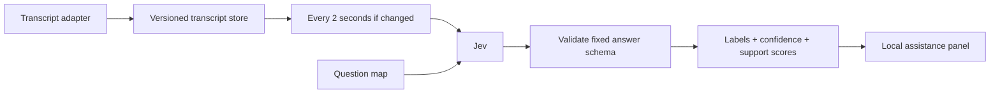

# Live in-call assistance using Jev

**By Ampup Team** · Sales calls and MEDDPICC as a worked example

A runnable reference implementation that turns a streaming transcript into live signals. It sends the latest transcript to Jev on a two-second tick and updates a local dashboard with labels, probabilities, confidence, and qualification coverage.

MEDDPICC is the example: **eight questions × three labels**, evaluated against one shared transcript in one request. BANT and sentiment maps are included so you can adapt the same pipeline to other structured assistance.

## Quick start — no API key

Requires **Python 3.11+**. The commands below work on macOS/Linux; on Windows activate with `.venv\Scripts\Activate.ps1` instead.

```bash
git clone https://github.com/A79-ai/jev-incall-assistance.git
cd jev-incall-assistance
python3 -m venv .venv
source .venv/bin/activate
python -m pip install -e .
jev-incall serve --mock
```

Open **http://127.0.0.1:8000** and click **Replay sample call**. Over about 20 seconds, the eight MEDDPICC cards move from unknown to supported. The panel shows which transcript version was evaluated, confidence, and coverage.

**Mock mode is a scripted UI fixture, not Jev inference.** It recognizes only the bundled sample sentences and returns canned probabilities. Custom text is not meaningfully classified. It needs no key, makes no external calls, and incurs no model charges.

## Use Jev

Get an API key from [TypeSafe](https://docs.typesafe.ai/). Stop the mock server, then run:

```bash
export TYPESAFE_API_KEY="your-typesafe-api-key"
jev-incall serve
```

The key stays in the Python process. Live mode sends transcript text to TypeSafe, including when you use the sample replay. Paste finalized turns into the panel, or feed them through the [ingestion API](docs/transcript-adapter.md). The server binds to loopback only.

The default model is pinned to `jev-1.13.0`. Use `--model jev-latest` or export `JEV_MODEL` to override it. `.env.example` documents the variables; this app does not automatically load `.env` files.

## The pipeline



- Finalized turns are upserted by stable ID. A higher revision replaces a corrected turn.
- One evaluation can be in flight per meeting. New updates replace pending work; they do not create a queue.
- Unchanged transcripts do not trigger another request. Slow responses keep their original version, and the UI says **Catching up** until the latest version is evaluated.
- Transient errors back off and retry the latest snapshot. Invalid credentials, invalid responses, and other permanent errors stop that meeting's evaluations.
- All fields arrive together. A label can move in either direction when the buyer corrects earlier information.

See [architecture and tradeoffs](docs/architecture.md) for scheduling, state, and lifecycle details.

## A fixed scoring problem

The MEDDPICC schema has eight stable field names and the same three labels for each:

| Label | Meaning |
| --- | --- |
| `unknown` | Evidence is absent, ambiguous, or incomplete. |
| `supported` | Explicit buyer evidence establishes the required information. |
| `contradicted` | Buyer statements conflict and the conflict remains unresolved. |

Conceptually, the response is an **8 × 3 probability matrix**. The panel displays the selected label, **P(supported)** as the support score, and the provider's separate confidence value. Coverage is `supported fields / 8`; six supported fields means 75% coverage. Neither coverage nor confidence is a probability of winning the deal. A strong competitor can count as supported Competition.

The working prompt maps are [MEDDPICC](src/jev_incall/prompts/meddpicc.json), [BANT](src/jev_incall/prompts/bant.json), and [sentiment](src/jev_incall/prompts/sentiment.json). The [prompt guide](docs/prompts.md) covers customization and evidence boundaries.

## Command line

Inspect the exact request without a key or network call:

```bash
jev-incall evaluate examples/snapshot.json --dry-run
```

Evaluate an entire snapshot once (one paid request in live mode):

```bash
jev-incall evaluate examples/snapshot.json
jev-incall evaluate examples/snapshot.json --framework bant
jev-incall evaluate examples/snapshot.json --questions path/to/questions.json
```

Replay one JSON turn event per line through the same live engine:

```bash
jev-incall replay examples/meeting.jsonl --mock
# Remove --mock to classify with Jev. Feed interval and classification cadence are separate.
jev-incall replay examples/meeting.jsonl --interval 2 --turn-delay 1
```

The CLI replay prints successive evaluated states and waits for the final transcript version. `--finish-timeout` defaults to 90 seconds. `evaluate` makes one attempt and exits on failure; retry scheduling belongs to the live engine.

## Quick napkin math

For a 30-minute call at 150 words a minute, assume roughly 6,000 transcript tokens by the end and 3,000 on average across 900 two-second updates. Add 1,500 tokens per call for questions and metadata: **900 × 4,500 ≈ 4.05 million input tokens**. At **$0.042 per million**, that's about **$0.17 for classification**, with no output charge. These are adjustable assumptions, not a measured meeting bill or a token count of the shipped prompts. [Jev pricing](https://docs.typesafe.ai/models), checked September 21, 2026.

```bash
jev-incall cost --minutes 30 --interval 2
```

The estimator uses a discrete cumulative sum and returns $0.170226 with those defaults. [Cost details](docs/cost.md) explain growth, skipped updates, and token usage.

## Development

```bash
python -m pip install -e '.[dev]'
ruff check .
ruff format --check .
pytest -q
```

If you use [uv](https://docs.astral.sh/uv/), `uv sync --extra dev --locked` installs the checked-in lockfile. Run commands with `uv run`.

Tests run offline with synthetic transcripts and HTTP mocks. They exercise response validation, revisions, coalescing during slow calls, retries, fatal errors, shutdown, API lifecycle, CLI behavior, and cost math. CI runs Python 3.11–3.13. They do not establish model accuracy; replay representative labeled calls to evaluate your rubric before relying on its signals.

## Repository map

```text
src/jev_incall/
  client.py          Direct Jev HTTP adapter and response validation
  engine.py          Per-meeting scheduling and versioned transcript state
  server.py          Local REST API and dashboard
  cli.py             serve, evaluate, replay, cost
  prompts/           MEDDPICC, BANT, sentiment question maps
  static/            Dashboard (plain HTML, CSS, JavaScript)
  data/              Synthetic sample call and scripted demo labels
examples/            Snapshot, JSONL stream, correction event
schemas/             Transcript event and snapshot schemas
docs/                Architecture, transcript adapter, prompts, cost
tests/              Offline automated checks
```

## Scope

This repo starts with **text from your transcription provider**. It does not join calls, capture audio, or implement speech recognition. The server stores meetings in memory and has no accounts or persistent history. It is a local reference app, not an internet-facing service. For deployment, add authentication, tenant isolation, durable storage, retention controls, and a shared worker architecture. API docs are at `/docs` when running locally.

Provider references: [HTTP API](https://docs.typesafe.ai/api) · [models and limits](https://docs.typesafe.ai/models) · [confidence](https://docs.typesafe.ai/confidence).

[MIT license](LICENSE) · Copyright Ampup AI.
