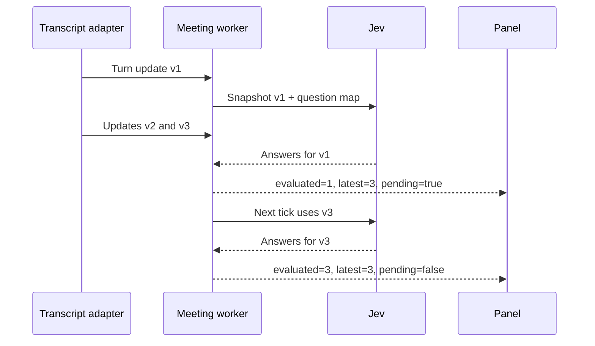

# Architecture

The unit of work is a meeting, not a turn. Each meeting owns its transcript, question map, worker, last evaluated version, last response, and error state. The Python evaluator is shared so HTTP connections can be reused.

## Scheduling

`Meeting.run()` uses a monotonic two-second tick. An unchanged or empty transcript does nothing. On a changed version, it copies the transcript and waits for one evaluation to finish. If the response is slow, missed ticks are skipped; at the next future tick the worker takes the newest transcript. There is no request backlog and no concurrent evaluation for one meeting.

For example, if version 1 is in flight while versions 2 and 3 arrive, the panel may receive version 1 with `pending: true`. The next evaluation uses version 3. The response is never relabeled as version 3. The panel retains the old result visibly while catching up.

The two-second interval is a scheduling cadence, not an end-to-end latency guarantee. Transcription delay, request time, and one-second browser polling add latency.

## State and failure handling

`turn_id` is stable across corrections. `revision` is a positive integer assigned by the adapter. Lower revisions are ignored; an identical event is idempotent. Different content at the same revision returns HTTP 409. Interim events (`final: false`) do not alter the stored transcript. A revision-only update does not increase the content version.

A snapshot is sorted by `start_ms`, then `turn_id`, and copied before the request. MEDDPICC and BANT evaluate the entire accumulated transcript. Live sentiment uses the last 12 finalized turns, so recent tone can change; this is a turn window, not a fixed time duration. The one-shot `evaluate` command evaluates exactly the snapshot supplied for all frameworks.

The provider adapter makes one HTTP attempt. Connection failures, timeouts, 408, 429, and server errors are retryable. The worker applies exponential backoff from two to 30 seconds and respects a longer numeric `Retry-After`. Retries use the latest snapshot. Other errors block the meeting, retaining its last valid result; correct the configuration and start a new meeting. Retried or cancelled requests may still have been billed by the provider.

Local limits are 16 active meetings, 2,000 turns per meeting, 12,000 characters per turn, and 80,000 accumulated transcript characters. The character guard does not guarantee a provider token budget. Context-limit failures are surfaced rather than silently dropping old qualification evidence. Use a tested summarization or memory strategy if extending to long meetings.

## Result contract

`GET /api/meetings/{id}` returns:

- Latest and evaluated transcript versions, pending/in-flight flags, and last update time.
- A field map with `label`, full `probabilities`, `support_score`, and `confidence`.
- Coverage for maps that have a `supported` option; sentiment has no coverage value.
- HTTP attempt count, successful evaluation count, returned token usage, model, and last latency.
- Current transcript turns and any sanitized error.

Before accepting answers, the client validates exact question IDs, answer types, allowed labels, finite probabilities summing to one, argmax selection, confidence range, and usage values. There is no generated prose or extracted evidence quote. Grounded evidence links would require a separate selection step.

The provider's confidence is kept intact. No arbitrary confidence threshold is presented as calibrated for your domain. The panel shows raw decisions for inspection; add thresholds or hysteresis only after evaluating your own labeled data.

## Local lifecycle and deployment

A new meeting creates one worker; deleting it cancels the worker and removes the transcript. A shutdown cancels all workers and closes the HTTP client. Closing a browser tab does not delete the server-side meeting; use Close meeting or the DELETE route. Unchanged meetings are idle and make no calls.

Run one Uvicorn process. The in-memory map is not shared across workers or machines. Host and Origin checks restrict the reference server to local use; there is no user authentication. No external JavaScript or analytics are loaded. User transcript text is inserted into the panel as text, not HTML.

A production adapter should explicitly map participants to roles, assign stable turn IDs/revisions, authenticate ingestion, and set a retention policy. Add durable state, per-tenant limits, metrics, and deployment-specific secrets handling before sharing the server. Do not expose this localhost demo by simply forwarding its port.
